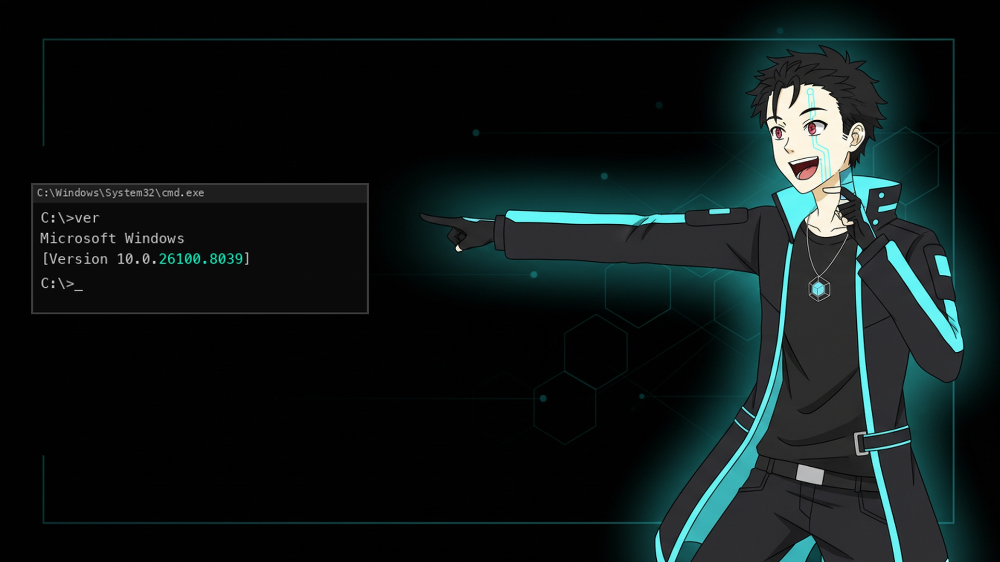
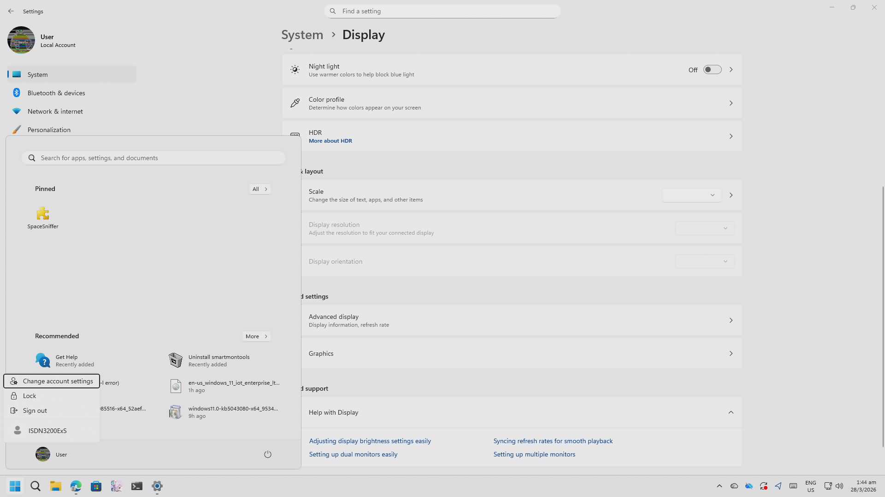
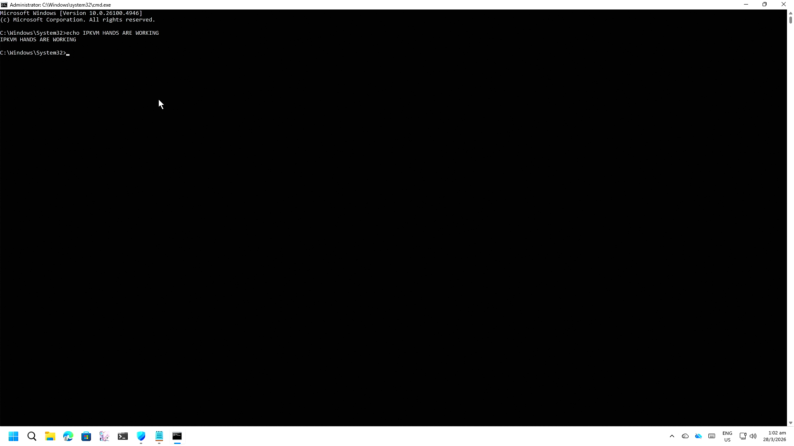
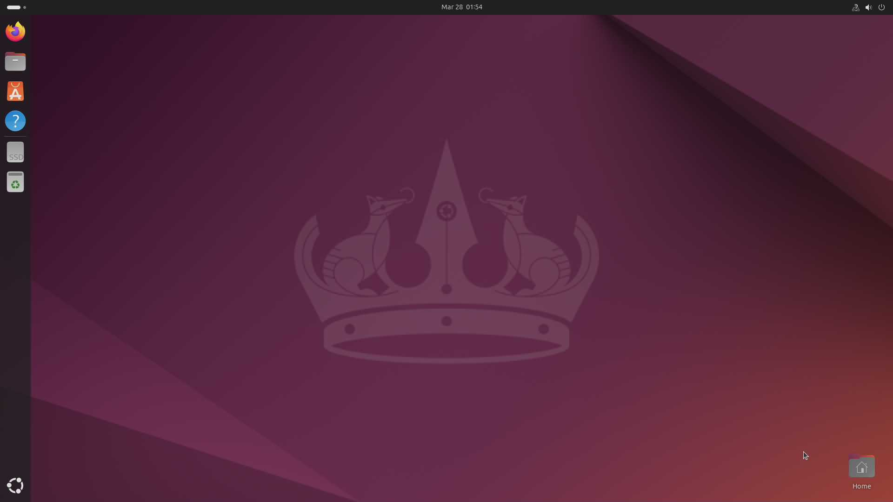

# corrupted-windows

**Righting a Windows install that hadn't taken a cumulative update in 6 months — four cascading root causes, an ESP32 keyboard emulator, a dedicated IP KVM, and an AI agent that spent two days reading CBS logs.**

> Built entirely through agentic coding with [Claude Code](https://claude.ai/code). The conversation ran across two marathon sessions, with the human in Shenzhen while the agent operated the machine overnight via SSH and IPKVM.



---

## The Problem

A Windows 11 IoT Enterprise LTSC 2024 desktop ("DeskPC") hadn't taken a cumulative update in 6+ months. KB5079473 (March 2026 security update) failed repeatedly. Every in-place upgrade attempt bounced with `0x80070003`. The machine was stuck on build 26100.4946, unpatched since October 2025.

What made this interesting: the machine *ran fine*. It booted. It worked. No crashes. Just updates, silently failing, every time. Six months of failure logs that nobody had read.

The question was simple: why won't it update? The answer took two days to find.

## The Machine

This wasn't a stock install. It had been through more than any install should survive:

- **ServerRdsh → LTSC edition migration** via registry hack (leaving 3,879 zombie server packages)
- **MBR → GPT disk conversion** (which silently mislabeled the EFI partition)
- **Multiple failed in-place upgrade attempts** and legacy boot misadventures
- **90,830 power cycles** on the boot SSD
- **Dead WinRE**, broken BCD, and a 128 GB pagefile "from crazy needs before"

As the user put it:

> *"This windows install has marched through several editions with it once being ServerRdsh at one point, then force-migrated to LTSC via registry trick. And several partition master migrations as well, with the disk once being MBR in the beginning and changed to GPT somehow in the middle where the WinRE kicked the bucket in between. It's a crazy install."*

The machine was valuable — peak Windows compute for the homelab. Clean install was not on the table.

## The Journey

### Four Root Causes

What looked like one problem turned out to be four independent issues stacked on top of each other, each masking the next.

#### 1. Component Store Corruption (0x80073712)

Every cumulative update failed at the staging phase. DISM RestoreHealth reported success, but CBS still couldn't resolve the execution chain.

**Root cause**: Orphaned server roles — Hyper-V, WAS, WCF, Containers — from the ServerRdsh era. These features had been disabled but their CBS package references remained, creating broken dependency chains that poisoned the staging pipeline.

**Fix**: Stripped all server features via `Disable-WindowsOptionalFeature`, removed the en-GB language pack that was pulling in WCF/WAS references, then RestoreHealth from the ISO WIM to repopulate sources.

#### 2. Reboot Crash — DPC_WATCHDOG_VIOLATION (0x133)

Every reboot crashed with a black-screen BSOD. The fault function: `nt!HvlSwitchToVsmVtl1`.

**Root cause**: VBS (Virtualization-Based Security) was enforced by 24H2, even with `hypervisorlaunchtype off` in BCD. The hypervisor attempted a VTL1 context switch on every shutdown, hung in a DPC, and crashed. Setting `hypervisorlaunchtype off` in BCD was not enough — 24H2 enforces VBS independently via the registry.

**Temporary workaround**: Disabled VBS, HVCI, and Credential Guard via registry keys under `HKLM\SYSTEM\CurrentControlSet\Control\DeviceGuard`. Clean reboots achieved for the first time. This is **not a permanent fix** — these are important hardware security features. The plan is to restore them after an in-place upgrade rebuilds the servicing stack cleanly (see [Future Actions](#future-actions)).

#### 3. Update Rollback — AdvancedInstallersFailed (0x800F0922)

With the component store clean and reboots working, updates staged and installed to 93% — further than ever before. But after every reboot, Windows rolled back: "Something didn't go as planned."

CBS logs showed `CbsExecuteStateFlagAdvancedInstallersFailed` with a specific CSI error: **`Bfs Hypervisor Launch Type mirroring failed`**. The AdvancedInstallers phase runs during boot to mirror BCD settings into the component store — but it couldn't find the BCD store.

**Root cause**: The EFI System Partition had the wrong GPT type GUID. The MBR-to-GPT conversion had set it to `{ebd0a0a2}` (Basic Data Partition) instead of `{c12a7328}` (EFI System Partition). The partition contained the correct EFI structure (`D:\EFI\Microsoft\Boot\BCD`), but `bcdedit` refused to find it because the partition type was wrong. CBS couldn't write to BCD during the AdvancedInstallers phase, so every update rolled back.

**Fix**: One diskpart command:
```
select disk 0
select partition 1
set id=c12a7328-f81f-11d2-ba4b-00a0c93ec93b
```

#### 4. Source Missing (0x800F081F)

After fixing the ESP GUID, staging failed with a new error — CBS couldn't find source files for components that referenced the removed en-GB language pack.

**Fix**: Set a permanent repair source to the ISO WIM via Group Policy registry (`HKLM\SOFTWARE\Microsoft\Windows\CurrentVersion\Policies\Servicing`), then RestoreHealth to repopulate the component store.

### Victory


*96% complete. Past where it always crashed. No BSOD, no rollback.*

With all four fixes applied, KB5079473 staged, installed, rebooted, finalized the AdvancedInstallers, and **persisted**. Then KB5085516, KB5083532, and KB5066131 followed — three more updates in the next cycle, all installing without intervention.

Build: **26100.4946** → **26100.8039**. Months of accumulated updates, cleared in one night.

### The IPKVM

SSH is the brain — but when the machine is rebooting, in BIOS, or showing a boot screen, SSH is gone. The agent needs **eyes** (screen capture) and **hands** (keyboard input) that work at every stage, independent of the OS.

```
┌─────────┐  HDMI out   ┌──────────────┐         ┌─────────┐
│ DeskPC  │────────────→│  IPKVM Eyes  │────────→│   Mac   │ ← agent runs here
│ (Win11) │             │ (capture)    │  HTTP   │  (SSH)  │
│         │  USB HID    ┌──────────────┐  TCP/WS │         │
│         │←────────────│ IPKVM Hands  │←────────│         │
└────┬────┘             │ (keyboard)   │         └─────────┘
     │                  └──────────────┘
     │  fallback boot
     ▼
┌─────────┐
│ Ubuntu  │ ← safety net (USB SATA SSD, default boot)
│  SSH    │   efibootmgr --bootnext for Windows
└─────────┘
```

Two approaches were built — either one gives full remote control:

| Approach | Eyes | Hands | Cost |
|----------|------|-------|------|
| **Commercial** | YiShu ES2 IP KVM (HDMI capture + HTTP snapshot API) | YiShu ES2 (built-in USB HID) | ¥268 (~$37) |
| **DIY** | HDMI capture card via Linux node | ESP32-S3 USB HID keyboard over WiFi TCP | ¥80 (~$11) |

For comparison: commercial IPKVM solutions (PiKVM, TinyPilot, Lantronix) start at $200–500, and IPMI-equipped server motherboards carry a $100+ premium. With agentic AI providing the software intelligence — writing its own firmware, protocols, and automation — the hardware cost drops to $11–37.


*Eyes: the IPKVM providing a crystal clear view of the DeskPC desktop.*


*Hands: "IPKVM HANDS ARE WORKING" — the ESP32-S3 USB HID keyboard typing commands to the DeskPC via WiFi TCP.*

**Safety net**: Ubuntu on a USB SATA SSD found in a drawer. Boot order defaults to Ubuntu — `efibootmgr --bootnext 0003` for Windows. Survives any Windows crash.


*Ubuntu booted accidentally from a USB SATA SSD. Became the most reliable part of the recovery environment — always SSH-accessible, always boots, always has `efibootmgr`.*

The combination of IPKVM + Ubuntu safety net turned out to be better than any purpose-built recovery environment: always-on SSH to Linux, visual access to boot screens, keyboard input at any stage, and `efibootmgr` to switch between OSes without touching hardware.

## The Root Cause Chain

```
MBR->GPT disk conversion (years ago)
  -> EFI partition gets wrong GUID (Basic Data instead of ESP)
    -> bcdedit can't find BCD store
      -> CBS AdvancedInstallers can't mirror hypervisor setting
        -> Every cumulative update's reboot phase fails
          -> Windows rolls back every update for 6+ months

ServerRdsh -> LTSC registry hack (years ago)
  -> 3,879 zombie Hyper-V/Container/Server packages in component store
    -> CBS dependency chains broken
      -> Component store "corruption" (0x80073712)

VBS enforcement on 24H2
  -> Hypervisor VTL1 switch hangs during reboot
    -> DPC_WATCHDOG_VIOLATION BSOD on every restart
```

Three unrelated historical decisions — a disk conversion, an edition hack, and a Windows version upgrade — combined to create a machine that booted fine, ran fine, but could never update. Each fix revealed the next layer.

## Lessons Learned

### For Windows users

1. **After any MBR-to-GPT conversion, verify the EFI partition GUID.** Run `Get-Partition` in PowerShell or `diskpart list partition`. The EFI System Partition must be type `{c12a7328-f81f-11d2-ba4b-00a0c93ec93b}`, not `{ebd0a0a2}` (Basic Data). This silently breaks `bcdedit` and Windows Update servicing — with no error messages pointing to the real cause.

2. **Windows edition migration via registry leaves deep scars.** Changing `EditionID` from ServerRdsh to IoTEnterpriseS doesn't remove the server packages — it orphans 3,879 of them. CBS can't transition packages that belong to a different edition. There is no clean path back, and the corruption may not surface until you try to update months later.

3. **VBS on Windows 11 24H2 overrides BCD.** `bcdedit /set hypervisorlaunchtype off` is not enough. VBS is enforced via `HKLM\SYSTEM\CurrentControlSet\Control\DeviceGuard\EnableVirtualizationBasedSecurity`. You must disable it in the registry AND BCD, or the hypervisor still loads. **Note:** VBS, HVCI, and Credential Guard are important security features. Disabling them should be a temporary diagnostic step, not a permanent solution.

4. **DISM RestoreHealth can report success while CBS still fails.** The tool verifies file integrity but not logical consistency of package dependency chains. "No component store corruption detected" doesn't mean updates will install.

5. **The reboot IS the update.** The percentage bar in Windows Update is just staging. The real work — AdvancedInstallers, driver registration, BCD mirroring — happens during the reboot's boot phase. A crash during this 2-minute window rolls back the entire update. This is why "stuck at 93%" is not stuck — it's about to do the hard part.

6. **Silent failures accumulate.** This machine had been failing updates for 6+ months with no visible symptoms. Windows Update's failure mode is quiet rollback, not a crash or an alert. Check `C:\Windows\Logs\CBS\CBS.log` and `C:\Windows\SoftwareDistribution\ReportingEvents.log` periodically if updates seem slow.

### For homelab builders

7. **Keep a Linux USB SSD as a safety net.** Ubuntu as default boot with `efibootmgr --bootnext` for Windows means you always have SSH access even when Windows is broken. You can mount NTFS, run DISM offline, fix boot records, and inspect CBS logs. Never change the default boot order back to Windows — always use `--bootnext` for one-shot Windows boots. A USB SATA SSD found in a drawer became the most critical piece of infrastructure in this recovery.

8. **Build the IPKVM before you need it.** Having eyes (HDMI capture) and hands (USB HID keyboard) during boot screens, BIOS, and WinPE is the difference between "wait for the human" and "fix it now." At $11–37, there's no excuse not to have one.

9. **SSH to Windows requires upfront investment.** Set PowerShell as default shell, install busybox for coreutils, add tools to PATH, set `LocalAccountTokenFilterPolicy=1` for remote admin. Do this before you need it, not during a recovery.

10. **HDMI capture on macOS is unreliable for long sessions.** USB capture cards drop out after ~10 minutes. Use a dedicated IPKVM device or route capture through a Linux node that won't go to sleep.

## On Agentic Operations

This project was built under an unconventional trust model: give the agent a real environment with real access, and let it fight real battles.

The agent had full SSH access, root on Linux nodes, admin on Windows, hardware control via IPKVM, and the latitude to operate overnight while the human was in another city. The constraint wasn't permissions — it was judgement. Don't break what you can't physically reach to fix.

Back in secondary school, I got myself a home computer for the explicit purpose of having a machine I could experiment on freely — no locked-down group policies, no restrictions on what I could install or break. That same philosophy extends to AI agents: lock them down and you get lock-down results. The agent that can read a CBS log, cross-reference it with a boot crash dump, piece together a 3-layer root cause chain, write ESP32 firmware from scratch, flash it over WiFi, and type recovery commands to a broken Windows machine — that agent needs room to work.

The practical lesson: "low guards, high trust" only works if you have a safety net. Ubuntu as default boot was the safety net here. The agent could reboot Windows aggressively because there was always a fallback. Hardware independence — remote keyboard, remote screen — meant the human never needed to be present. The overnight session produced more progress than any number of supervised sessions would have.

**What made agentic recovery possible:**
- SSH to both OSes (primary + fallback)
- Visual access to boot screens (IPKVM eyes)
- Keyboard at every stage, including pre-boot (IPKVM hands)
- Persistent task tracking across reboots
- The agent reading and interpreting its own error logs without guidance

**What would have blocked it:**
- Requiring human approval for every reboot
- No fallback OS (one bad reboot = no more access)
- Interactive-only recovery tools (no SSH equivalent)
- Restricted filesystem access (couldn't read CBS logs)

The IPKVM was not a nice-to-have. It was the difference between a recovery that took one overnight session and one that required the human to fly back home.

## Key Files

```
esp32-hid/                  ESP32-S3 USB HID keyboard firmware (PlatformIO)
  src/main.cpp              WiFi TCP + OTA + serial, USB keyboard emulation
  platformio.ini            Board config for YD-ESP32-S3 (ESP32-S3-WROOM-1)
docs/
  offline-update-guide.md   DISM offline update via USB boot or WinRE
archive/
  images/                   Screenshots from the session
```

## Hardware

| Component | Details |
|-----------|---------|
| CPU | AMD (integrated Radeon Graphics) |
| RAM | 7 GB |
| Boot SSD | Samsung 970 EVO Plus 1TB |
| OS | Windows 11 IoT Enterprise LTSC 2024 (build 26100.8039) |
| IPKVM | YiShu ES2 + ESP32-S3 USB HID |
| Safety net | Ubuntu on USB SATA SSD |

## Future Actions

This machine is functional and receiving updates, but the job isn't done:

1. **In-place upgrade** — Run `setup.exe /auto upgrade` from the LTSC 2024 ISO to fully rebuild the CBS servicing stack. This should eliminate the 3,879 zombie ServerRdsh packages and resolve the edition migration scars permanently.

2. **Restore hardware security features** — VBS, HVCI, and Credential Guard were disabled as a temporary workaround for the DPC_WATCHDOG_VIOLATION. After the in-place upgrade, bisect to determine the minimum security configuration needed for stable reboots. The goal is full hardware integrity with all security features enabled.

3. **Improve the IPKVM** — The ESP32-S3 USB HID firmware needs OTA reliability improvements. The HDMI capture path should be standardized on the YiShu ES2 (most reliable). Consider adding mouse support for GUI-heavy scenarios.
